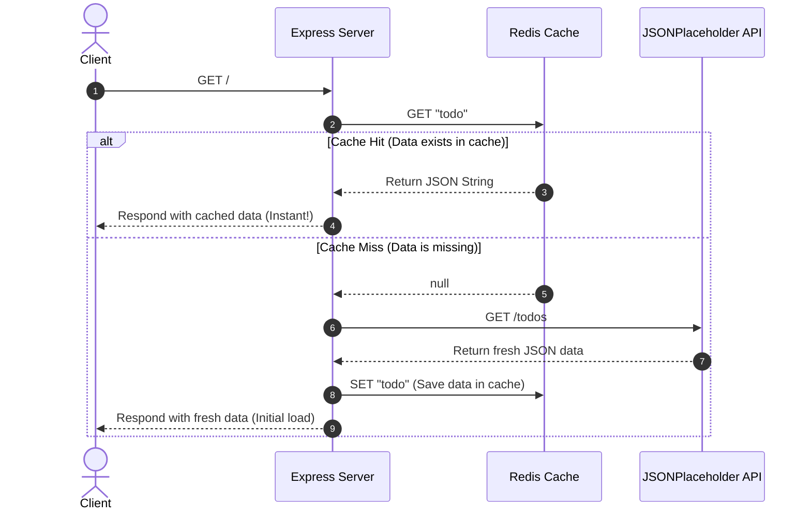

# Redis Node.js Integration 🚀

A structured, hands-on JavaScript playground showcasing standard **Redis** commands using Node.js, the `ioredis` library, and Express.js for practical API caching. It contains clear, runnable examples of various Redis data structures like **Strings**, **Lists**, **Sets**, and **Hashes**, along with an API caching demonstration.

---

## 📌 Project Overview

This repository serves as a cheat sheet and interactive workspace for developers to learn and test Redis commands programmatically, as well as understand how to implement basic API caching. It demonstrates:
- **20+ String Operations** (e.g., `SET`, `GET`, `MSET`, `INCR`, `APPEND`, etc.)
- **17+ List Operations** (e.g., `LPUSH`, `RPUSH`, `LPOP`, `RPOP`, `LTRIM`, `BLPOP`, etc.)
- **15 Set Operations** (e.g., `SADD`, `SREM`, `SINTER`, `SUNION`, etc.)
- **14 Hash Operations** [NEW] (e.g., `HSET`, `HGET`, `HGETALL`, `HDEL`, `HEXISTS`, etc.)
- **Express API Caching** [NEW] - Real-world example caching external API data (JSONPlaceholder) to reduce response times and system load.

---

## 🛠️ Prerequisites & Redis Setup

To run this project locally, you need:
1. [Node.js](https://nodejs.org/) (v16 or higher recommended)
2. **Redis Server** running locally on the default port `6379`.

### 🐳 Option A: Running Redis via Docker (Recommended)
If you have Docker installed, you can start a Redis container instantly with:
```bash
docker run --name local-redis -p 6379:6379 -d redis
```

### 💻 Option B: Running Redis on Windows
Since Redis is not natively supported on Windows, we recommend one of the following:
* **WSL2 (Windows Subsystem for Linux):** Install Ubuntu in WSL2, run `sudo apt update && sudo apt install redis-server`, and start the service with `sudo service redis-server start`.
* **Docker Desktop:** Use Option A above.

### 🍎 Option C: Running Redis on macOS
Using Homebrew:
```bash
brew install redis
brew services start redis
```

---

## 🚀 Getting Started

### 1. Install Dependencies

Install all node modules (Express, Axios, and ioredis) by running:
```bash
npm install
```

### 2. Run the Examples

Before running any script, make sure your Redis server is active.

* **To run the Express Server (API Caching Demo):**
  ```bash
  npm start
  # or: node server.js
  ```
  *Once started, open `http://localhost:5000/` in your browser. The first request fetches data from JSONPlaceholder (slow), while subsequent requests load instantly from memory!*

* **To run Hash commands sandbox:**
  ```bash
  npm run run:hash
  # or: node hash.js
  ```

* **To run String commands sandbox:**
  ```bash
  npm run run:string
  # or: node string.js
  ```

* **To run List commands sandbox:**
  ```bash
  npm run run:list
  # or: node list.js
  ```

* **To run Set commands sandbox:**
  ```bash
  npm run run:set
  # or: node set.js
  ```

---

## 📂 Project Structure

```bash
├── redis.js       # Redis client connection setup (ioredis configuration)
├── server.js      # Express server illustrating real-world Redis API caching
├── string.js      # Sandbox containing 20 different String-based Redis commands
├── list.js        # Sandbox containing 17 different List-based Redis commands
├── set.js         # Sandbox containing 15 different Set-based Redis commands
├── hash.js        # Sandbox containing 14 different Hash-based Redis commands
├── package.json   # Project dependencies and custom npm runner scripts
└── .gitignore     # Git ignore rules (node_modules, etc.)
```

---

## 💡 Code Highlights

### Client Connection (`redis.js`)
```javascript
const redis = require('ioredis');
const client = new redis(); // Connects to 127.0.0.1:6379 by default
module.exports = client;
```

### API Caching Pattern (`server.js`)
```javascript
app.get('/', async (req, res) => {
  // 1. Check if cached data exists in Redis
  const cachedValue = await client.get('todo'); 

  if (cachedValue) {
    return res.json(JSON.parse(cachedValue)); // Return cached data immediately
  }

  // 2. If not cached, fetch from third-party API
  const { data } = await axios.get("https://jsonplaceholder.typicode.com/todos/");
  
  // 3. Cache the result in Redis for future requests
  await client.set('todo', JSON.stringify(data));
  
  return res.json(data);
});
```

### 📊 API Caching Flow Diagram
The sequence diagram below visualizes how requests are managed between the client, the backend server, Redis, and the external API:



---

## 📘 Deep Dive into Data Structures

### 1. Strings (`string.js`)
Strings are the most basic type of Redis value. Redis strings are binary-safe, meaning they can contain any kind of data (like images or serialized JSON structures) up to 512 MB.
* **Featured Operations:** TTL-based operations (`SETEX`, `PSETEX`), atomic increment/decrement, and binary offsets/substring commands (`GETRANGE`, `SETBIT`).

### 2. Lists (`list.js`)
Redis Lists are lists of strings sorted by insertion order. You can push or pop values from both the left (head) and right (tail) of the list.
* **Featured Operations:** Queue/Stack modeling (`LPUSH`/`RPUSH`), blocking pops (`BLPOP`/`BRPOP`), element indexes, and list size metrics.

### 3. Sets (`set.js`)
Sets are unordered collections of unique strings. You can perform set mathematics (unions, intersections, differences) very quickly.
* **Featured Operations:** Set math (`SINTER`, `SUNION`, `SDIFF`), checking membership (`SISMEMBER`), and moving members (`SMOVE`).

### 4. Hashes (`hash.js`)
Hashes are records represented as field-value pairs, making them the ideal data structure to represent objects (e.g., a "user" object with fields like name, age, city).
* **Featured Operations:** Field getters/setters (`HSET`, `HGETALL`), math modifiers (`HINCRBYFLOAT`), and incremental scan helpers (`HSCAN`).

---

## 📋 Implemented Commands Summary

### 🔹 Strings (`string.js`)
| Command | Description | Command | Description |
|---|---|---|---|
| `SET` / `GET` | Set & retrieve values | `MSET` / `MGET` | Multi set & get |
| `GETRANGE` | Get substring of a key | `SETEX` / `PSETEX` | Set key with TTL (seconds/ms) |
| `GETSET` | Set key & return old value | `SETNX` / `MSETNX` | Set if key does not exist |
| `INCR` / `DECR` | Increment/Decrement counter | `INCRBY` / `DECRBY` | Increment/Decrement by step |
| `STRLEN` | Get length of value | `APPEND` | Append text to existing value |
| `GETBIT` / `SETBIT` | Get/set bit at offset | `SETRANGE` | Overwrite part of a string |
| `INCRBYFLOAT` | Increment key by float amount | | |

### 🔸 Lists (`list.js`)
| Command | Description | Command | Description |
|---|---|---|---|
| `LPUSH` / `RPUSH` | Push elements to head/tail | `LPOP` / `RPOP` | Pop elements from head/tail |
| `LRANGE` | Get range of list elements | `LLEN` | Get length of the list |
| `LSET` | Set value of element by index | `LTRIM` | Trim list to specified range |
| `LINSERT` | Insert element before/after pivot | `LREM` | Remove elements from list |
| `BLPOP` / `BRPOP` | Blocking pop from head/tail | `BRPOPLPUSH` | Blocking pop list1 to push list2 |
| `LPUSHX` / `RPUSHX` | Push only if list exists | `RPOPLPUSH` | Pop from one list, push to another |
| `LINDEX` | Get element by index | | |

### 🟢 Sets (`set.js`)
| Command | Description | Command | Description |
|---|---|---|---|
| `SADD` | Adds members to a set | `SCARD` | Gets set member count |
| `SDIFF` | Subtracts multiple sets | `SDIFFSTORE` | Subtracts sets & stores result |
| `SINTER` | Intersects multiple sets | `SINTERSTORE` | Intersects sets & stores result |
| `SISMEMBER` | Checks if member exists in set | `SMEMBERS` | Gets all members of a set |
| `SMOVE` | Moves a member between sets | `SPOP` | Removes & returns random member |
| `SRANDMEMBER` | Gets random members from set | `SREM` | Removes members from a set |
| `SUNION` | Unions multiple sets | `SUNIONSTORE` | Unions sets & stores result |
| `SSCAN` | Incrementally iterates set elements | | |

### 🟡 Hashes (`hash.js`)
| Command | Description | Command | Description |
|---|---|---|---|
| `HSET` / `HGET` | Set & get field value in hash | `HDEL` | Delete field from hash |
| `HEXISTS` | Check if field exists in hash | `HGETALL` | Get all fields & values in hash |
| `HINCRBY` | Increment integer field value | `HINCRBYFLOAT` | Increment float field value |
| `HKEYS` / `HVALS` | Get all keys/values in hash | `HLEN` | Get number of fields in hash |
| `HMGET` / `HMSET` | Multi field set/get in hash | `HSETNX` | Set field only if it doesn't exist |
| `HSCAN` | Incrementally iterate hash fields | | |

---

## 🔍 Troubleshooting

* **Error: `ECONNREFUSED 127.0.0.1:6379`**
  * **Cause:** The Node.js application cannot establish a connection with Redis because the server daemon is not active.
  * **Resolution:** Ensure Redis is running in the background. Execute `redis-cli ping` in your terminal; you should receive a `PONG` response if it is functioning. If running on Docker, ensure the container is started (`docker start local-redis`).

---

## 📄 License

This project is open-source and available under the [ISC License](LICENSE).
